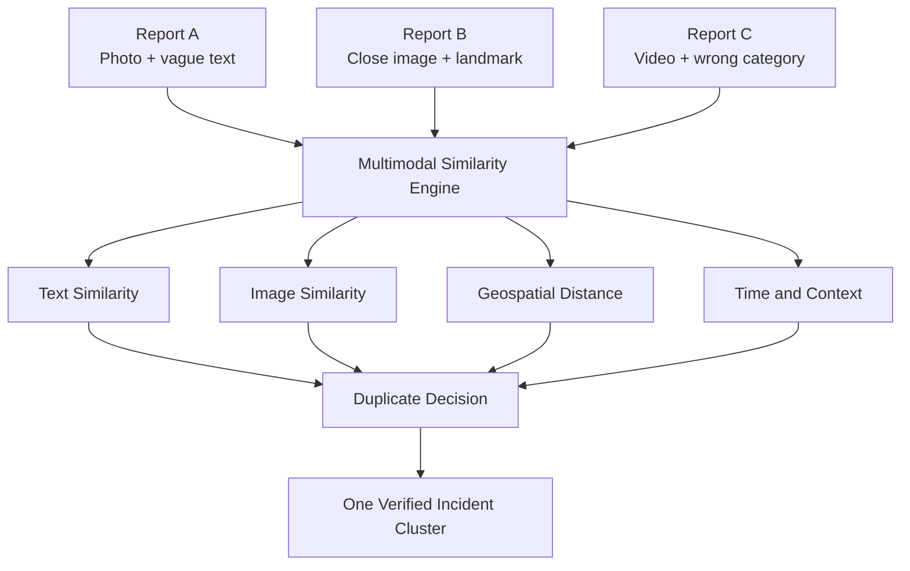
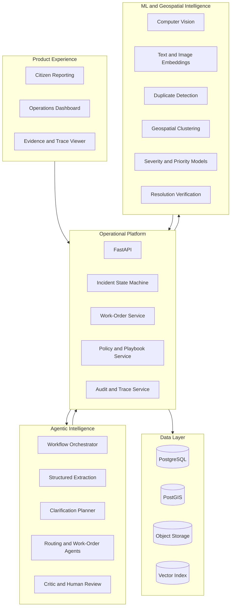
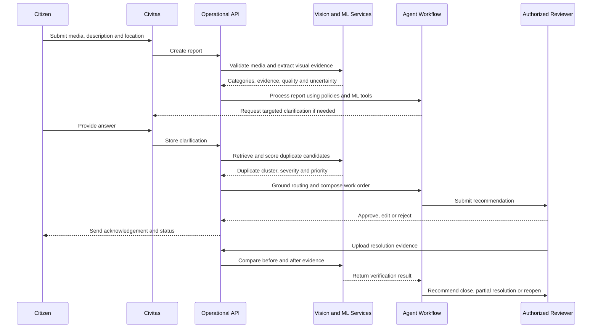

<div align="center">

# Civitas

### Turning every civic report into clear, accountable action.

**Live Application**: [https://civitas-web.vercel.app](https://civitas-web.vercel.app) · **API**: FastAPI & PostGIS on Render

A multimodal civic incident intelligence platform that transforms fragmented public reports into verified incidents, explainable priorities, correctly routed work orders, and accountable resolution.

</div>

---

## What is Civitas?

Civitas helps cities and public-service organizations understand and act on civic issues reported by residents.

A citizen may upload a photograph of a pothole, a short video of a water leak, a description of an overflowing waste point, or the location of a fallen tree. In many systems, each report becomes an isolated complaint that must be manually interpreted, categorized, checked for duplication, prioritized, and routed.

Civitas turns that fragmented input into a structured operational case.

It combines:

- multimodal artificial intelligence,
- computer vision,
- geospatial analysis,
- duplicate detection,
- policy-grounded agent workflows,
- explainable risk assessment,
- human review,
- and before-and-after resolution verification.

The goal is not to replace public officials. The goal is to give them clearer evidence, better prioritization, and a more reliable path from citizen report to field action.

---

## Why this matters

Civic reporting systems commonly face five problems:

1. **Incomplete reports**  
   Citizens may submit a photo without enough context, use the wrong category, or omit details that affect safety and routing.

2. **Duplicate complaints**  
   The same pothole, leak, obstruction, or streetlight may be reported several times from different angles and locations.

3. **Inconsistent prioritization**  
   A large issue is not always the most urgent. A smaller hazard near a school, hospital, busy junction, or accessible pathway may require faster action.

4. **Incorrect routing**  
   Reports may be sent to the wrong department or require coordination between several departments.

5. **Weak closure verification**  
   An incident may be marked resolved even when the uploaded evidence shows that the issue is only partially addressed.

Civitas creates an intelligence layer between public reporting and municipal operations.

```mermaid
flowchart LR
    A[Citizen Report] --> B[Evidence Validation]
    B --> C[Multimodal Understanding]
    C --> D[Clarification]
    D --> E[Duplicate Detection]
    E --> F[Severity and Priority]
    F --> G[Policy-Grounded Routing]
    G --> H[Human Review]
    H --> I[Work Order]
    I --> J[Resolution Evidence]
    J --> K[Before/After Verification]
```

<div align="center">



</div>

---

## Core capabilities

### Multimodal incident understanding

Civitas can process:

- photographs,
- selected video frames,
- written descriptions,
- GPS coordinates,
- submission time,
- landmarks,
- and follow-up answers.

The system separates:

- **observable evidence** — what can be directly seen or confirmed,
- **retrieved knowledge** — what comes from municipal policy or operational guidance,
- **inference** — what the system believes may be true but cannot directly prove.

This separation reduces unsupported conclusions and makes each recommendation easier to review.

---

### Intelligent clarification

The system does not ask broad or repetitive questions.

It asks only when an answer could materially affect:

- incident classification,
- duplicate detection,
- severity,
- response priority,
- department routing,
- or operational safety.

For example, when a fallen tree is reported, the most useful question may be whether electrical wires are involved—not simply asking the citizen to “provide more details.”

---

### Duplicate incident detection

Civitas determines whether separate reports refer to the same real-world incident.

It combines:

- text semantic similarity,
- image embedding similarity,
- geographic distance,
- time proximity,
- category agreement,
- landmark overlap,
- and contextual features.

<div align="center">



</div>

Instead of creating several independent complaints, Civitas can create one incident cluster containing all supporting reports and evidence.

---

### Separate severity and priority

Civitas treats severity and priority as different decisions.

- **Severity:** How dangerous or harmful is the incident?
- **Priority:** How urgently should the responsible authority respond?

A moderate obstruction near a hospital entrance may receive higher priority than a larger obstruction in a low-traffic area.

Each score is accompanied by contributing factors, such as:

- road or pedestrian exposure,
- school or hospital proximity,
- electrical risk,
- public-health impact,
- number of reports,
- time unresolved,
- accessibility obstruction,
- and weather escalation.

---

### Policy-grounded routing

Civitas does not rely on a language model to invent departmental responsibility.

Routing decisions are grounded in:

- municipal policies,
- department jurisdictions,
- incident-category rules,
- escalation conditions,
- and operational playbooks.

The system can identify:

- a primary department,
- supporting departments,
- escalation requirements,
- relevant policy references,
- and the evidence behind the recommendation.

---

### Structured work orders

Once an incident has been reviewed, Civitas can generate an operational work order containing:

- incident summary,
- location and landmarks,
- verified evidence,
- required actions,
- recommended resources,
- safety notes,
- responsible department,
- supporting departments,
- estimated resolution range,
- and review status.

The generated work order remains editable and reviewable by authorized staff.

---

### Resolution verification

When field work is completed, new evidence can be uploaded.

Civitas compares the original and final evidence and classifies the outcome as:

- **resolved,**
- **partially resolved,**
- **unverifiable,**
- or **conflicting evidence.**

Uncertain results remain open for human review rather than being automatically closed.

---

## Product experience

Civitas is designed around two simple interfaces.

### Citizen reporting

Residents can:

- submit an image or short video,
- add a short description,
- share or select a location,
- answer targeted clarification questions,
- receive an acknowledgement,
- and follow the status of the incident.

### Operations dashboard

Authorized reviewers can:

- view incidents on a map,
- inspect clustered reports,
- review visual and textual evidence,
- compare duplicate-scoring factors,
- inspect severity and priority explanations,
- verify department routing,
- approve or edit work orders,
- review resolution evidence,
- and inspect the full decision trace.

The citizen experience remains simple. The operational interface exposes the deeper reasoning only where it is useful.

---

## System architecture

<div align="center">



</div>

---

## End-to-end processing flow

<div align="center">



</div>

---

## Decision traceability

Every important output should be traceable to its source.

Civitas records:

- submitted evidence,
- extracted facts,
- model versions,
- similarity features,
- policy references,
- agent decisions,
- confidence basis,
- reviewer actions,
- workflow timestamps,
- validation errors,
- and final resolution evidence.

This makes the system inspectable instead of treating artificial intelligence as a black box.

---

## Technical stack

| Layer | Technology direction |
|---|---|
| Web application | Next.js, React, TypeScript |
| Backend | FastAPI, Python |
| Database | PostgreSQL through Supabase |
| Geospatial data | PostGIS |
| Media storage | Supabase Storage |
| Agent orchestration | LangGraph |
| Structured language reasoning | Provider-neutral clients with Groq support |
| Text embeddings | Provider-agnostic embedding interface |
| Image embeddings | CLIP-compatible vision embeddings |
| Machine learning | scikit-learn and model-specific Python tooling |
| Mapping | Leaflet or Mapbox |
| Testing | pytest, Vitest and Playwright |
| Deployment | Vercel, Render and Supabase |

The architecture is intentionally modular. Individual model providers, storage systems, or deployment services can be replaced without redesigning the complete product.

---

## Repository structure

```text
civitas/
├── apps/
│   ├── web/                    # Citizen and operations interfaces
│   └── api/                    # FastAPI application
│
├── services/
│   ├── workflow/               # Agent orchestration
│   ├── knowledge/              # Policy and playbook grounding
│   ├── evaluation/             # Workflow benchmarks
│   ├── ml/                     # Model inference services
│   ├── policies/               # Municipal policy access
│   ├── storage/                # Media handling
│   └── operations/             # Incidents and work orders
│
├── ml/
│   ├── vision/                 # Image and video analysis
│   ├── duplicates/             # Similarity and clustering
│   ├── risk/                   # Severity and priority models
│   ├── resolution/             # Before-and-after verification
│   └── training/               # Reproducible model experiments
│
├── database/
│   ├── migrations/
│   └── seed/
│
├── prompts/                    # Versioned production prompts
├── schemas/                    # Shared contracts
├── datasets/                   # Dataset manifests and labels
├── tests/
│   ├── workflow/
│   ├── evaluation/
│   ├── ml/
│   ├── api/
│   └── e2e/
└── docs/
```

---

## Evaluation strategy

Civitas is evaluated as a complete decision system, not only as a set of model outputs.

### Model-level evaluation

- incident classification precision, recall and F1,
- duplicate precision, recall and F1,
- cluster quality,
- severity agreement,
- priority agreement,
- routing accuracy,
- and resolution-verification accuracy.

### Workflow-level evaluation

- structured-output validity,
- missing-information detection,
- clarification usefulness,
- unsupported-claim rate,
- work-order completeness,
- human-review acceptance,
- end-to-end task completion,
- latency,
- and model cost.

### Comparative evaluation

The structured workflow can be compared against:

1. a simple single-prompt approach,
2. a large all-in-one prompt,
3. and the complete Civitas workflow using specialized models, retrieval, validation, critique, and human review.

The goal is not to produce perfect-looking numbers. The goal is to produce reproducible results, expose failure cases, and show where decomposition and verification improve reliability.

### Evaluation Distinction: Offline vs. Live Inference

| Evaluation Layer | Scope & Method | Live API Key Required? | Current Verified Status |
| :--- | :--- | :--- | :--- |
| **Offline Deterministic Architecture Evaluation** | 394+ unit, contract, and Golden E2E integration tests validating schema parsing, PostGIS spatial queries, CLIP feature extraction, risk scoring, duplicate clustering, policy retrieval, and LangGraph workflow interrupts. | **No** (runs offline with mock adapters & frozen datasets) | **394+ tests passing** |
| **Live Groq Model Evaluation** | Real-time structured output generation against Groq-hosted `llama-3.3-70b-versatile` and `llama-3.1-8b-instant` models. | **Yes** (`GROQ_API_KEY`) | Verified via `scripts/smoke_groq.py` in live deployments. |


---

## Example scenario

Three residents report one water-leak incident near a school:

- the first report contains a distant image and vague text,
- the second includes a close image and mentions two-wheelers slipping,
- the third is a short video but is incorrectly categorized as a pothole.

Civitas should:

1. identify water leakage and road flooding,
2. merge all three reports into one incident cluster,
3. use school proximity and traffic exposure to raise priority,
4. request only decision-relevant clarification,
5. route the issue to the water department with traffic coordination,
6. prepare one evidence-backed work order,
7. update all reporters,
8. and later verify whether the issue was fully or partially resolved.

---

## Engineering principles

- **Evidence before inference**  
  Important conclusions must be tied to submitted evidence, structured data, retrieved policy, or an explicitly labelled inference.

- **Schemas before automation**  
  Outputs that control downstream logic must pass strict validation.

- **Severity is not priority**  
  Safety impact and response urgency are calculated and explained separately.

- **Models must be inspectable**  
  Predictions should include model version, contributing factors, uncertainty, and failure behavior.

- **Human review remains available**  
  High-impact routing, work-order, escalation, and closure decisions remain reviewable.

- **Shared contracts are versioned**  
  Breaking changes to schemas or service interfaces must be deliberate and documented.

- **Metrics must be reproducible**  
  Reported results should come from defined datasets, repeatable commands, and preserved evaluation outputs.

- **Failure is a valid state**  
  The system should abstain, retry, or escalate when evidence is insufficient instead of manufacturing certainty.

---

## Product boundaries

Civitas is an operational decision-support system.

It is not:

- an emergency-response authority,
- a replacement for municipal staff,
- a legal compliance certificate,
- a surveillance platform,
- a predictive-policing system,
- or a promise that every reported issue will be resolved within a generated timeframe.

Resolution estimates are non-binding, and safety-critical recommendations require authorized review.

---

## Current development direction

The initial product focuses on five incident categories:

- potholes and road damage,
- water leakage and localized flooding,
- garbage overflow and obstruction,
- broken streetlights,
- fallen trees and blocked pathways.

The first implementation priorities are:

1. shared schemas and service contracts,
2. multimodal report intake,
3. duplicate incident intelligence,
4. separate severity and priority assessment,
5. policy-grounded routing,
6. structured work orders,
7. resolution verification,
8. and reproducible end-to-end evaluation.

---

<div align="center">

### Civitas

**Turning every civic report into clear, accountable action.**

Built around evidence, explainability, and accountable human decisions.

</div>


## Demo media

Large demo images and videos are kept outside Git. Restore versioned open-media references and externally hosted local demo assets with:

```bash
python scripts/fetch_demo_media.py
```

Downloads are checked against the SHA-256 hashes in `datasets/demo_data/manifest.json`.
