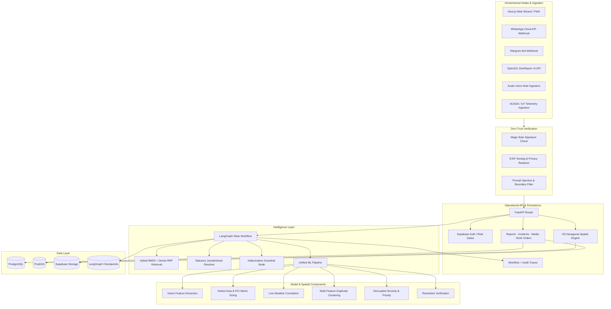

<div align="center">

# Civitas

### Turning every civic report into clear, accountable action.

**Live application:** [https://civitas-web.vercel.app](https://civitas-web.vercel.app)

Civitas is a multimodal civic incident intelligence platform that converts citizen reports into structured incidents, geospatially informed priorities, policy-grounded routing, reviewable work orders, and traceable resolution decisions.

</div>

---

## What Civitas does

Civic reports arrive as incomplete, duplicated, and sometimes contradictory evidence: a photo with little context, a video filed under the wrong category, several reports describing the same incident, or a location whose operational significance is not obvious from the description alone.

Civitas turns that input into an operational case by combining:

- image and video understanding,
- duplicate and cluster analysis,
- PostGIS-based spatial context,
- separate severity and priority assessment,
- deterministic policy and playbook grounding,
- LangGraph-based agent orchestration,
- human review at high-impact decision points,
- and before/after resolution verification.

The platform is designed for two connected users: residents reporting civic issues and municipal teams responsible for reviewing, routing, acting on, and closing those incidents.

---

## From report to action


Civitas keeps evidence types distinct throughout this flow:

- **Observed evidence** comes from media, sensor signals, and EXIF coordinates.
- **Reported claims** come from the citizen and remain attributable to the report.
- **Retrieved knowledge** comes from municipal policies and operational playbooks.
- **Inference** is explicitly separated from evidence and policy.

That separation is central to how routing, escalation, work-order generation, and review remain inspectable.

---

## Core capabilities

### Omnichannel intake & zero-trust ingestion

Civitas supports high-volume citizen submissions across multiple modern communication channels:
- **Responsive Web Wizard & PWA**: Features client-side HTML5 canvas downsampling to compress mobile camera photos ($\le 1920\times 1080$ at $0.85$ JPEG quality) from 40MB down to $<1.2\text{MB}$ in $<200\text{ms}$.
- **WhatsApp & Telegram Webhooks**: Accepts messages, photos, and location pins directly from chat applications.
- **Open311 GeoReport v2 Standard Adapter**: Full interoperability with standard civic 311 reporting tools and municipal mobile clients.
- **Voice Note / Audio Intake**: Ingests citizen voice notes (`.ogg`, `.mp3`, `.wav`, `.m4a`) with audio header validation.
- **EXIF Geotagging & Zero-Trust Privacy Redaction**: Automatically extracts embedded GPS coordinates and capture timestamps while stripping camera make, model, and device serial identifiers prior to persistent storage.
- **Binary Magic Byte Verification**: Validates binary headers against declared MIME types to prevent polyglot file execution attacks.

### Multimodal evidence understanding & defect metric sizing

Civitas processes citizen text, photographs, selected video frames, GPS coordinates, timestamps, landmarks, and clarification responses. The vision layer produces structured outputs—including defect bounding geometry, estimated surface area ($cm^2$), cavity/ponding depth ($mm$), and Pavement Condition Index (PCI) distress scores—that can be consumed by downstream duplicate, risk, and workflow components without treating free-form model text as an operational contract.

### H3 hexagonal spatial indexing & recurrence intelligence

Civitas maps every incident to discrete global hexagonal grid cells (H3 Resolution 8 at ~460m and Resolution 9 at ~174m). The spatial engine tracks 6-month historical recurrence velocity and automatically flags `CHRONIC_FAILURE_ZONE` hotspots where recurring structural degradation (such as aging water mains or unpaved sub-bases) requires capital renewal rather than isolated point patches.

### Environmental & SCADA IoT telemetry fusion

The intelligence layer correlates citizen reports with live meteorological telemetry (freeze-thaw thermal oscillations between -3°C and +4°C, cloudburst precipitation $>25mm/hr$) and municipal SCADA transducer alarms (water distribution pressure drops, acoustic leak loggers, power grid anomalies). This separates acute weather-driven runoff from mechanical infrastructure ruptures.

### Duplicate and incident clustering

Multiple reports can describe the same real-world event. Civitas combines textual similarity, visual similarity, geospatial distance, temporal proximity, category agreement, and contextual features to determine whether reports should remain separate or contribute to a shared incident cluster.

### Severity and priority as separate decisions

Severity represents the level of harm or hazard. Priority represents response urgency. A moderate issue near a school gate, hospital entrance, or busy transport corridor can require faster action than a more severe issue in a low-exposure area. Civitas keeps these signals separate and records the factors that influence each decision.

### Policy-grounded routing & jurisdictional boundary resolution

Routing is strictly constrained by retrieved municipal policy, statutory operating standards, and jurisdictional boundaries:
- **Multi-Vector Hybrid Retrieval with RRF**: Combines exact BM25 keyword matching with dense semantic embeddings using Reciprocal Rank Fusion ($RRF(d) = \sum \frac{1}{60 + rank_i(d)}$) so specialized equipment names and operational codes are never diluted by broad semantic matches.
- **Statutory Jurisdictional Resolver**: Resolves legal maintenance boundaries (National Highways Authority, State PWD, Municipal Ward Corporation, Metro Rail Transit, Private Layouts) to prevent inter-agency ping-pong and pin legal SLA mandates.
- **Departmental Assignment**: Identifies primary dispatch authority, supporting agencies, statutory escalation pathways, and required equipment.

### Dynamic conversational clarification engine

When incoming evidence lacks critical operational parameters (e.g. active water ingress into electrical rooms vs street pooling), LangGraph enters a typed `clarification_needed` interrupt state:
- Dynamically formats conversational SMS, WhatsApp, and Telegram quick-selection prompts (`1️⃣`, `2️⃣`, `3️⃣`).
- Ingests citizen replies via `/api/v1/intake/clarify-reply`, parses natural language or digit responses, updates graph state, and resumes execution on the exact same thread without workflow duplication.

### Adversarial hallucination guardrails & citation verification

Civitas deploys an explicit guardrail validation node before work orders or department routes are finalized:
- **Statutory Entity Verification**: Rejects hallucinated non-existent municipal departments and normalizes aliases to statutory catalog entities.
- **SLA Boundary Clamping**: Validates SLA targets against statutory policy envelopes ($2\text{h} \le SLA \le 168\text{h}$).
- **Prompt Injection Defense**: Filters adversarial prompt injections ("ignore previous instructions", "bypass human review") from citizen inputs.
- **Citation Backing**: Flags ungrounded work orders for mandatory supervisor review.

### Agentic decision workflow

The LangGraph workflow coordinates specialized stages for evidence structuring, clarification, ML intelligence, knowledge retrieval, routing, operational planning, critique, human review, and citizen communication. Workflow state is typed, checkpointed, and resumed on the same thread after clarification or review interrupts.

### Human review and controlled edits

Authorized reviewers can approve, reject, request more evidence, edit permitted work-order fields, or override routing through narrow typed contracts. The frontend cannot inject arbitrary graph state, and backend authorization remains authoritative.

### Resolution verification

New field evidence can be compared with the original report to classify an outcome as resolved, partially resolved, unverifiable, or conflicting. Ambiguous evidence remains reviewable instead of being converted into a false closure signal.

---

## Product experience

### Citizen reporting

Residents can submit a description, media, and location; receive targeted clarification when the workflow needs information that can materially change a decision; and follow the incident state through the same workflow identifier used by the operational system.

### Municipal workspace

The operations interface combines incident queueing, geospatial context, evidence review, severity and priority, policy-backed routing, work-order planning, workflow state, human-review actions, and safe execution traces.

### Interactive workflow demonstration

The live application includes a seeded water-leak scenario that shows how related reports are consolidated, how school and traffic context affect urgency, how playbooks are retrieved, and how the workflow reaches human review before continuing to citizen communication.

---

## System architecture



### Runtime boundaries

- `workflow_runs` stores operational workflow metadata such as workflow ID, report ID, status, interrupt type, trace ID, and timestamps.
- LangGraph owns checkpoint state and resumes execution through a stable `thread_id`.
- The unified ML bridge exposes structured analysis to the workflow without duplicating model logic in the agent layer.
- Knowledge retrieval returns provenance-bearing policy references and explicit insufficiency states.
- Browser clients use public authenticated API routes; internal service credentials stay server-side.

---

## Technical stack

| Layer | Technology |
|---|---|
| Web | Next.js 16, React 19, TypeScript |
| API | FastAPI, Pydantic, Python 3.12 |
| Database | PostgreSQL / Supabase |
| Geospatial | PostGIS |
| Storage | Supabase Storage |
| Agent orchestration | LangGraph |
| LLM provider layer | Provider-neutral client with Groq support |
| Vision | CLIP-compatible image representations and deterministic CV features |
| Duplicate intelligence | Text, image, spatial, temporal and contextual similarity |
| Risk | Structured severity and priority models |
| Resolution | Before/after evidence verification |
| Mapping | Leaflet |
| Frontend testing | Vitest |
| Backend testing | pytest |
| Deployment | Vercel, Render, Supabase |

---

## Repository structure

```text
apps/
├── web/                     Next.js product interface
└── api/                     FastAPI operational API

services/
├── workflow/                LangGraph orchestration and LLM provider layer
├── knowledge/               Policy/playbook retrieval and grounding
├── evaluation/              Baseline and workflow evaluation
├── ml/                      Unified ML runtime interfaces
├── operations/              Operational service boundary
├── policies/                Policy service boundary
└── storage/                 Storage service boundary

ml/
├── vision/                  Image/video analysis
├── duplicates/              Similarity and clustering
├── risk/                    Severity and priority
├── resolution/              Resolution verification
└── training/                Model experiments and reproducible utilities

database/
├── migrations/              Spatial, operations, policy and workflow schema
└── seed/                    Deterministic policy and demo scenario data

prompts/                     Versioned agent and baseline prompts
schemas/                     Shared JSON contracts
datasets/                    Evaluation and demo-data manifests
docs/                        Architecture, API, workflow and deployment docs
```

---

## Evaluation

Civitas evaluates both component behavior and the complete decision workflow.

### Component evaluation

The ML layer includes reproducible checks for vision classification, duplicate decisions, clustering behavior, severity and priority logic, and resolution verification. Results are stored with dataset/version context rather than presented as isolated headline scores.

### Workflow evaluation

The workflow evaluator compares three executable systems on a common corpus:

1. a competent single-prompt baseline,
2. a structured single-call mega-prompt baseline,
3. the full Civitas graph using specialized agents, ML tools, knowledge retrieval, critique, and human-review semantics.

Offline runs use deterministic LLM fixtures so contracts, graph execution, metrics, serialization, and comparison outputs remain reproducible without external credentials. The evaluation runner also supports live provider execution through the same LLM abstraction. Offline architecture results and live-provider results are kept separate by design.

### Golden runtime slice

The FastAPI golden integration test exercises the actual report context, local ML pipeline, knowledge service, LangGraph graph, routing/work-order persistence, human-review interrupt, same-thread approval resume, completion, trace persistence, and idempotent restart behavior. Only external LLM output is replaced by a deterministic test client.

---

## Decision traceability

Civitas records safe operational evidence for review and audit:

- report and incident identifiers,
- submitted evidence and media metadata,
- structured evidence distinctions,
- model/tool identifiers,
- duplicate and risk outputs,
- policy references,
- routing and work-order decisions,
- validation outcomes,
- reviewer actions,
- workflow status and interrupts,
- node latency and retry metadata,
- and resolution evidence.

Hidden chain-of-thought, credentials, authorization headers, and server-side secrets are not part of the trace surface.

---

## Security and control model

- Supabase sessions provide browser authentication; backend authorization remains authoritative.
- Production startup requires the configured JWT-verification secret and internal service key.
- Internal ML/runtime routes are not exposed through browser credentials.
- Review actions are role-gated and schema-constrained.
- Policy-dependent decisions validate cited knowledge references.
- Missing policy evidence produces partial support or abstention rather than invented rules.
- Workflow business records are idempotent where duplicate execution could create operational conflicts.
- CORS is restricted to the deployed web origin in production configuration.

---

## Incident coverage

The production taxonomy is defined centrally and shared across report intake, model contracts, and workflow logic. The core civic categories include road damage, water leakage/localized flooding, waste obstruction, streetlight failure, and fallen-tree/pathway obstruction, with supported extensions represented through the same typed contracts.

---

## Engineering ownership

Civitas was built as a three-person engineering system with explicit module ownership and a single integration lead.

- **Dhruv Gupta — Team Lead, System Architecture & Agentic Decision Platform**  
  Owns the end-to-end product workflow, agentic analysis and decision system, LangGraph orchestration, policy-grounded reasoning, frontend, cross-module context and contracts, final integration, deployment, and system-level validation.

- **Pavit Aggarwal — Computer Vision, ML & Geospatial Intelligence**  
  Owns computer-vision pipelines, duplicate and clustering intelligence, severity/priority model work, geospatial intelligence, resolution-verification ML, and model evaluation.

- **Utkarsh — Backend, Data & Municipal Operations**  
  Owns the FastAPI operational layer, database persistence, API contracts, incident/work-order operations, role-gated review flows, and municipal state transitions.

---

## Documentation

- [`docs/architecture/README.md`](docs/architecture/README.md) — system boundaries and runtime architecture
- [`docs/api/README.md`](docs/api/README.md) — API surface and operational contracts
- [`docs/agentic-workflow.md`](docs/agentic-workflow.md) — LangGraph state, nodes, interrupts and review semantics
- [`docs/knowledge-layer.md`](docs/knowledge-layer.md) — policy retrieval, provenance and abstention
- [`docs/ml-methodology/README.md`](docs/ml-methodology/README.md) — ML component methodology and evaluation principles
- [`docs/evaluation.md`](docs/evaluation.md) — baseline and workflow evaluation design
- [`docs/runtime-integration.md`](docs/runtime-integration.md) — runtime composition, persistence and resume behavior
- [`docs/DEPLOYMENT_GUIDE.md`](docs/DEPLOYMENT_GUIDE.md) — deployment topology and environment configuration

---

## Demo media

Large demo images and videos remain outside Git. The repository keeps a manifest with source metadata and SHA-256 hashes, and `scripts/fetch_demo_media.py` restores versioned open-media references or externally hosted demo assets without placing binary media in source control.

---

<div align="center">

### Civitas

**Evidence-backed civic intelligence with accountable human decisions.**

</div>
