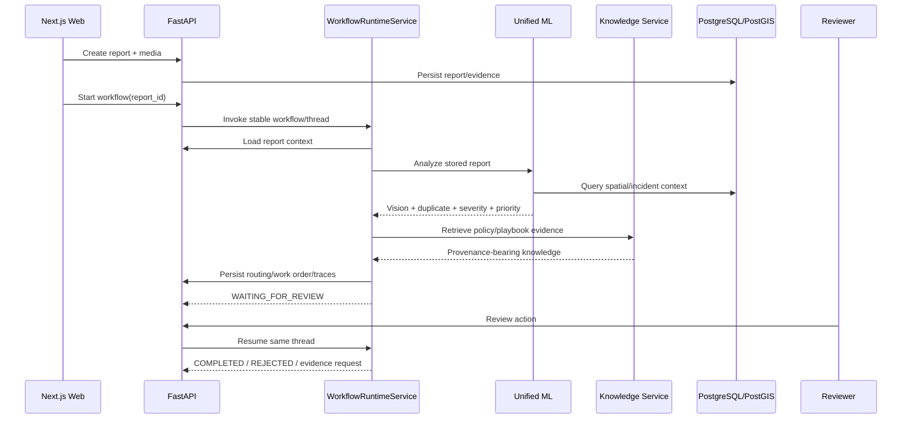

# Civitas API Integration

This document describes how the web application, operational API, LangGraph runtime, knowledge service, and ML pipeline cooperate during a civic incident workflow.

## Integration topology

## Report intake

The report API receives the citizen description, supported category, and geographic coordinates. Media is stored separately and associated with the report through media records. Local browser previews are not treated as uploaded evidence until the API confirms persistence.

## Workflow start

`POST /api/v1/reports/{report_id}/workflow` creates or reuses the workflow metadata record associated with the report. The runtime assigns a stable `workflow_id`, `thread_id`, and trace context, then invokes the compiled LangGraph graph.

Repeated start requests reuse the existing operational workflow rather than creating duplicate routing decisions or work orders.

## Context and ML analysis

The context loader retrieves the stored report, media metadata, location, incident linkage, clarification state, and persisted analysis where available. The ML intelligence tool consumes the unified `ReportAnalysis` contract, which contains:

- vision output,
- duplicate candidates,
- cluster result,
- severity,
- priority,
- model metadata,
- basis fields,
- warnings,
- trace identifier.

The LLM does not recalculate deterministic ML scores.

## Knowledge grounding

The workflow retrieves policy and playbook records by incident category, department, purpose, and available context. Retrieved knowledge retains stable record IDs and provenance. Routing and operational outputs that depend on policy must cite valid knowledge IDs.

When the corpus does not support a policy-dependent claim, the knowledge result reports partial support or insufficiency and the workflow routes the decision through review rather than fabricating a rule.

## Clarification interrupt

A clarification interrupt is created only when missing information can materially change classification, duplicate handling, severity, priority, routing, or safety. The API exposes the interruption through workflow status.

`POST /api/v1/workflows/{workflow_id}/clarification` validates and persists the answer, then resumes the same LangGraph `thread_id` using `Command(resume=...)`.

## Human-review interrupt

The workflow stops at human review before high-impact operational execution. Review actions are:

- `APPROVE`
- `EDIT`
- `REROUTE`
- `REJECT`
- `REQUEST_MORE_EVIDENCE`

`EDIT` and `REROUTE` use narrow schemas and cannot inject arbitrary workflow state. The backend persists the reviewer action and resumes the existing graph thread.

## Work-order persistence

The operational plan is persisted through the existing work-order service. Replay/idempotency guards keep repeated workflow execution from producing duplicate operational records.

## Traces

Node-level trace records contain safe execution metadata such as node name, status, model/tool, latency, retry count, knowledge references, validation status, warnings, and trace ID. Credentials, authorization headers, prompts containing sensitive report content, and hidden chain-of-thought are excluded.

## State ownership

Two persistence layers have intentionally different responsibilities:

- `workflow_runs` stores application metadata: workflow ID, thread ID, report/incident IDs, trace ID, status, interrupt type, and timestamps.
- LangGraph's PostgreSQL saver stores graph checkpoints and resume state keyed by `thread_id`.

The application does not duplicate checkpoint state in its own tables.

## Media and spatial context

Media is associated with reports through the media API and storage adapter. Geospatial analysis is provided by the `civitas_geo` package/PostGIS queries for nearby incidents, landmarks, density, and distance-based context.

Map-link extraction is available for supported share URLs and resolves validated coordinates before report creation.

## State transitions

Operational transitions are validated by the state-machine layer. Invalid incident or work-order transitions return a conflict response instead of silently mutating state. See [`STATE_MACHINE.md`](STATE_MACHINE.md) for the complete lifecycle.
