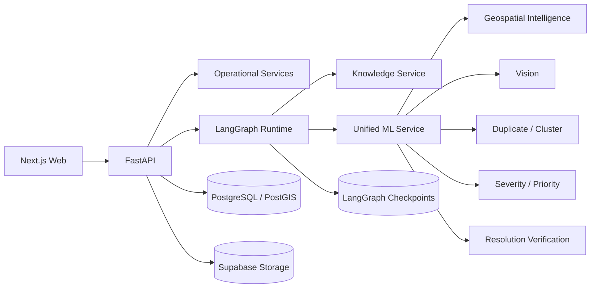

# Civitas Architecture

Civitas is organized around four operational boundaries: product experience, operational API, intelligence services, and persistent data. Each boundary communicates through typed contracts rather than direct cross-module state access.

## Architecture overview

## Product boundary

`apps/web` contains the public reporting flow, municipal workspace, incident detail, human-review interface, profile/auth experience, documentation, and seeded workflow demonstration. Browser code consumes only public API contracts and Supabase client-safe credentials.

## Operational API boundary

`apps/api` owns authentication, report/media intake, incident state, routing persistence, work orders, clarification, resolution, workflow execution endpoints, and safe traces. It is the authoritative boundary for role-gated mutations.

## Agentic decision boundary

`services/workflow` owns the typed LangGraph state and orchestration. The graph coordinates deterministic context loading and ML tools with specialized LLM stages for evidence structuring, clarification, routing, operational planning, critique, review, and citizen communication.

Workflow state is checkpointed by LangGraph using a stable `thread_id`. The application `workflow_runs` table stores only operational metadata such as workflow ID, report ID, status, interrupt type, trace ID, and timestamps.

## Knowledge boundary

`services/knowledge` retrieves municipal policies and playbooks through deterministic-first filtering and ranking. Results retain source identifiers and provenance. Downstream agents validate cited knowledge references before policy-dependent outputs are accepted.

## ML boundary

`services/ml` exposes a unified analysis interface over the component packages in `ml/`. It combines media intelligence, duplicate candidates, cluster context, severity, priority, model metadata, basis fields, and warnings in one typed result contract.

## Data boundary

- PostgreSQL stores operational entities and workflow metadata.
- PostGIS supports proximity, landmark, density and incident-candidate queries.
- Supabase Storage stores report media and resolution evidence.
- LangGraph's PostgreSQL saver owns graph checkpoint tables independently from application migrations.

## Cross-module contracts

Shared JSON schemas under `schemas/` define stable shapes for evidence, assessment, routing, work orders, resolution, traces, knowledge results, and API envelopes. Python Pydantic models and frontend types align with those contracts at module boundaries.

## Reliability properties

- deterministic test composition replaces only the external LLM provider;
- clarification and review resume the same workflow thread;
- business writes use idempotent/natural-key guards where replay could create duplicates;
- missing policy evidence produces partial support or abstention;
- hidden chain-of-thought and credentials are excluded from persisted traces.
